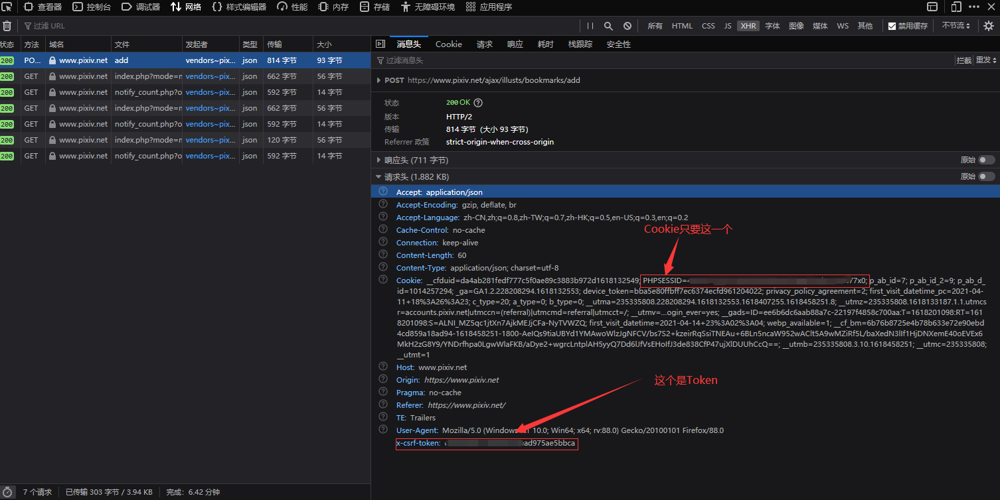

#Pixiv爬虫


先配置 [Cookie和Token 以及代理](./lib/api/pixiv_request.dart)
<br/>

<br/>
###去pixiv.net 打开调试 随意点一个书签或者关注


```dart
import 'api/pixiv_request.dart';

void main() {
  ///第1页  r18模式
  PixivRequest.instance.getRanking(1, true, decodeException: (e) {
    print('反序列化异常');
  }, requestException: (e) {
    print('请求异常');
  }).then((rankingData) {
    print(rankingData);
  });
}
```

